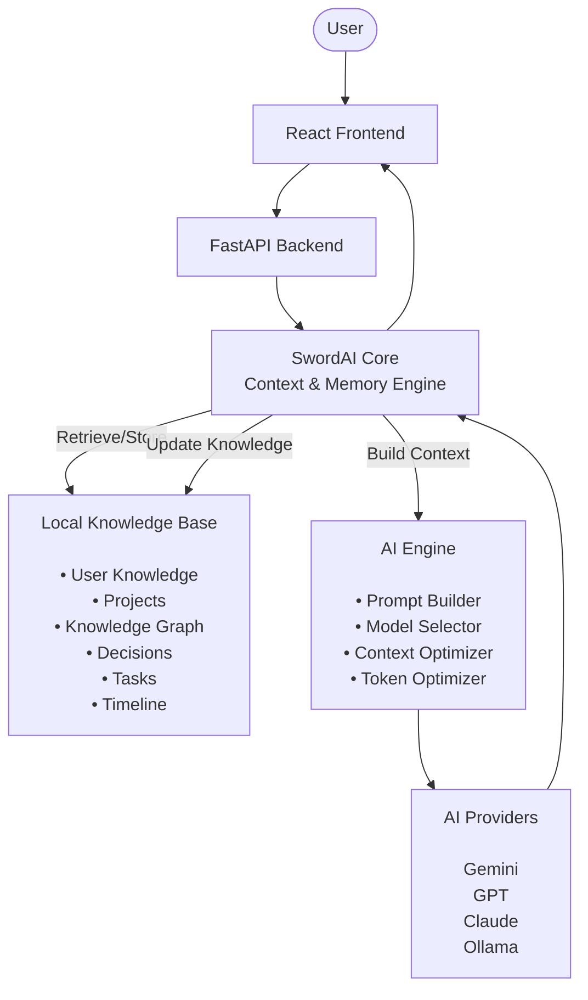

# 🏗 SwordAI Architecture

**Version:** v0.1

**Status:** Active (Architecture Frozen)

**Last Updated:** 13 July 2026

> This document describes the current architecture of SwordAI.
> The architecture will only be updated when a major architectural improvement or new core capability is introduced.
> All architectural changes must be documented in `Decisions.md`.

## 1. React Frontend

**Purpose**

Provides the interface through which users interact with SwordAI.

**Responsibilities**

- Chat Interface
- Voice Interaction
- Project Management
- File Uploads
- Settings

## 2. Local Knowledge base

**Stores**

- User Brain
- Projects
- Knowledge Graph
- Decisions
- Tasks
- Timeline
- Notes
- Research

The Local Knowledge Base is the single source of truth for SwordAI.

## 3. Context & Memory Engine

**Purpose**

Acts as the brain of SwordAI by managing context and long-term memory.

**Responsibilities**

- Understand the user's request.
- Identify the relevant project.
- Retrieve only the required knowledge from the Local Knowledge Base.
- Send the relevant context to the AI Engine.
- Analyze the AI response.
- Extract important knowledge from the conversation.
- Update the Local Knowledge Base with new knowledge.

The Context & Memory Engine is responsible for both context retrieval and memory management, enabling SwordAI to continue projects from any conversation while minimizing token usage.

## 3. AI Engine

**Purpose**

Prepares optimized requests for AI providers.

**Responsibilities**

- Prompt Building
- Context Optimization
- Token Optimization
- AI Provider Selection

The AI Engine never stores memory permanently.
It only performs reasoning using the context provided by the Context & Memory Engine.

## 4. AI Provider

The AI Provider performs reasoning only and return the responses in between memory engine retrives relevant knowledge.
It has no permanent memory of the user's projects.

# Project Philosophy

SwordAI is knowledge-centric, not conversation-centric.

- Conversations are temporary.
- Knowledge is permanent.
- Projects exist independently of chats.
- The Local Knowledge Base is the source of truth.
- Any conversation can continue any project.

### 6. Request Flow

## Step 1 — User Request

The user sends a request through the React frontend.

Example:

Continue SwordAI.

---

## Step 2 — Backend

The FastAPI backend receives the request and forwards it to the Context & Memory Engine.

---

## Step 3 — Understand Context

The Context & Memory Engine identifies:

- Project
- Intent
- Required Knowledge

---

## Step 4 — Retrieve Knowledge

Relevant knowledge is retrieved from the Local Knowledge Base.

Examples:

- Architecture
- Decisions
- Tasks
- Timeline
- Notes

Only the required knowledge is retrieved, reducing token usage.

---

## Step 5 — Build Prompt

The AI Engine:

- Builds the prompt
- Optimizes context
- Selects the AI Provider

---

## Step 6 — AI Reasoning

The AI Provider generates a response.

---

## Step 7 — Knowledge Extraction

The Context & Memory Engine extracts any important information.

Examples:

- New Decision
- Completed Task
- Architecture Update
- New Feature

---

## Step 8 — Memory Update

The extracted knowledge is stored inside the Local Knowledge Base.

---

## Step 9 — Return Response

The response is sent back to the user.

SwordAI is now ready to continue the project from any future conversation.

# Core Principle

> Conversations create knowledge.
>
> Knowledge builds intelligence.

SwordAI remembers knowledge instead of conversations.

Every interaction either retrieves existing knowledge or creates new knowledge, allowing the assistant to continuously improve while keeping context focused and token-efficient.